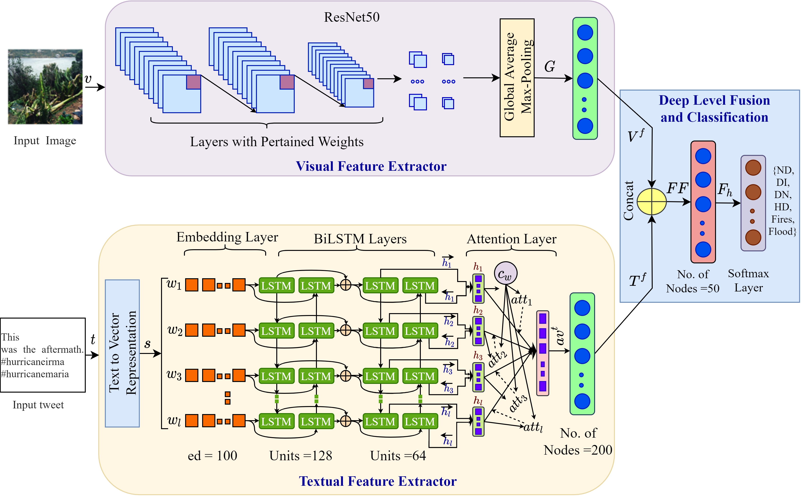

## A Deep Attentive Multimodal Learning Approach for Disaster Identification From Social Media Posts

**Author:** Eftekhar Hossain, Mohammed Moshiul Hoque, Enamul Hoque, Md. Saiful Islam

**Venue:** IEEE Access (Q1, IF-3.367)   

**Paper Link:** [https://ieeexplore.ieee.org/abstract/document/9764741](https://ieeexplore.ieee.org/abstract/document/9764741)

**Dataset Link:** [Damage Identification](https://archive.ics.uci.edu/ml/datasets/Multimodal+Damage+Identification+for+Humanitarian+Computing)

## Contribution
- We propose a multimodal architecture that utilizes ResNet50 and BiLSTM recurrent neural network with attention mechanism to classify the damage-related
posts by exploiting both visual and textual information.
- We compare the performance of the proposed model with a set of existing unimodal (i.e., image, text) and multimodal classification techniques.
- We empirically evaluate the proposed model on a benchmark dataset and demonstrated how introducing attention could enhance the system performance through an
intrinsic evaluation.
- We perform both quantitative and qualitative analysis to get deeper insights about the error types which provide future directions for improving the model.

## System Overview
Figure 2 presents the schematic diagram of our proposed system, which has three major phases: visual feature extractor, textual feature extractor, and deep level fusion.

## Ackonwlegement
This work was supported by the Natural Sciences and Engineering Research Council (NSERC), Canada.

